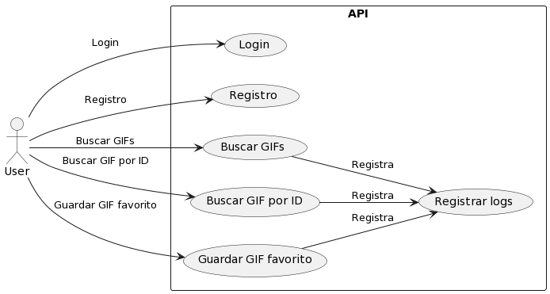
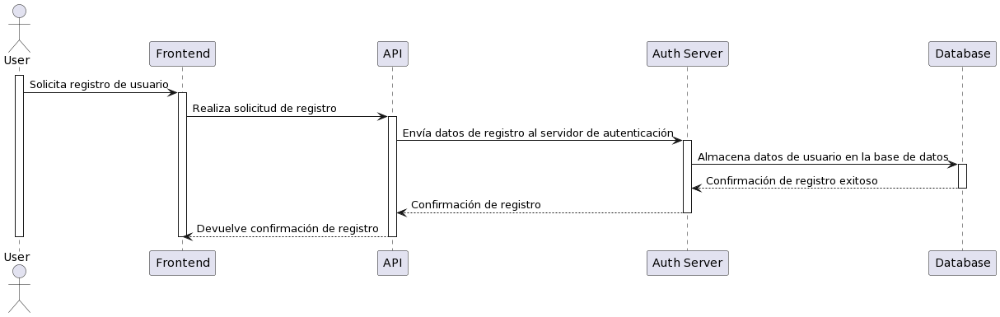
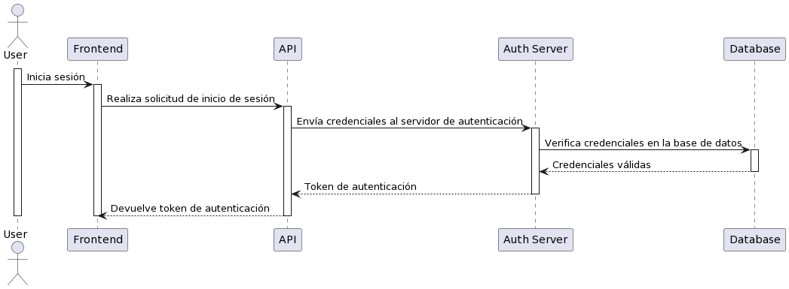
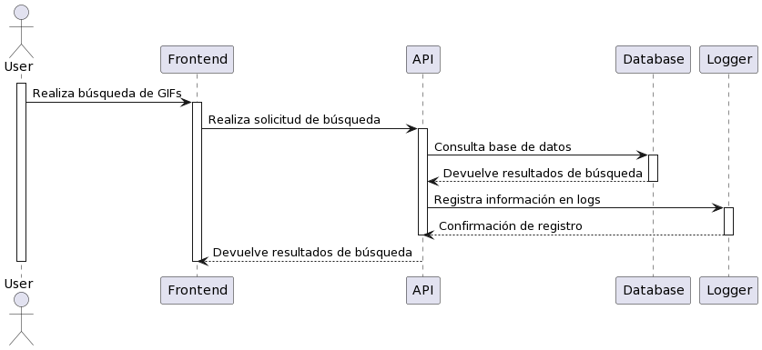
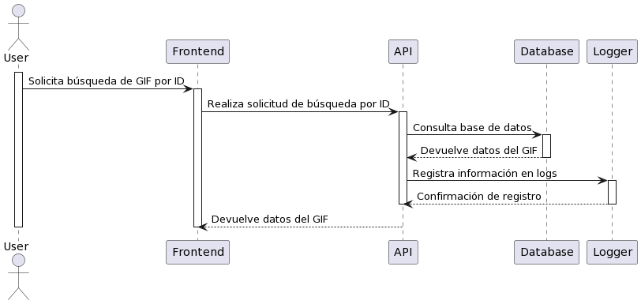
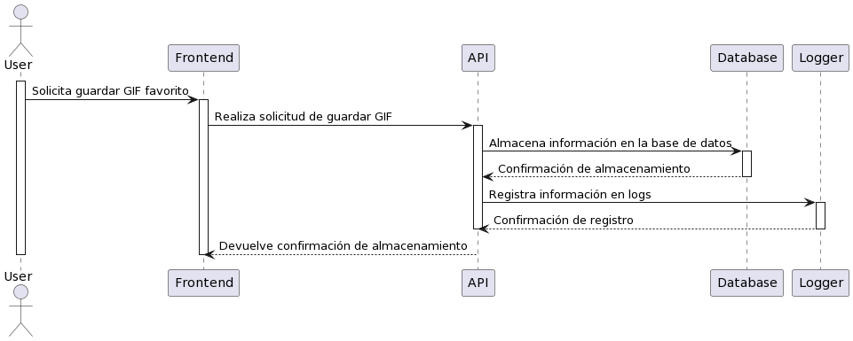
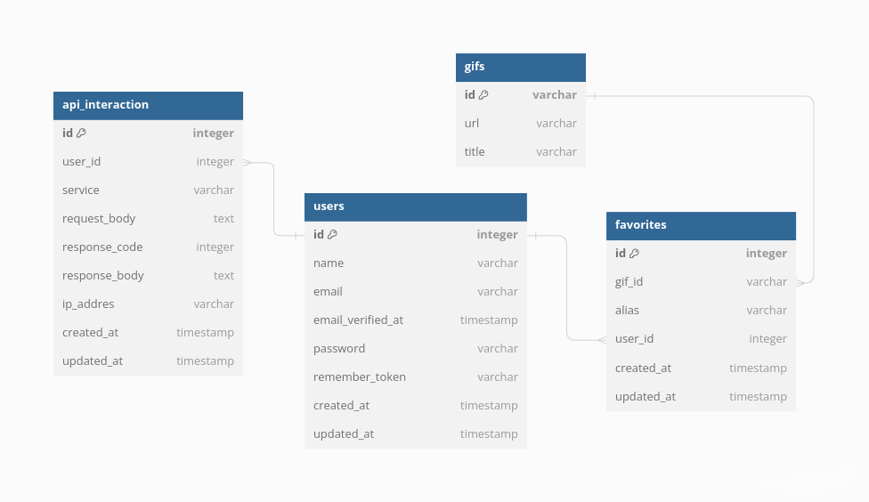
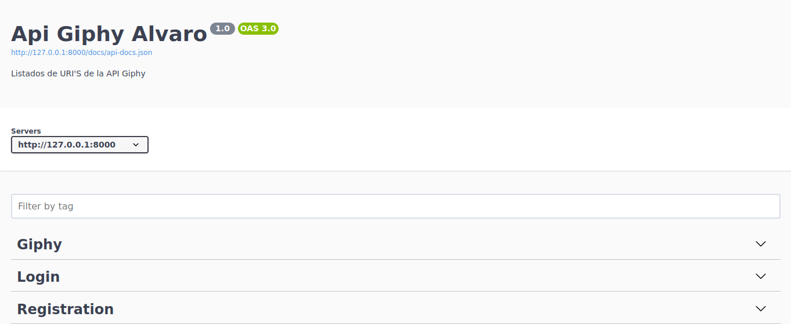

# Proyecto Laravel 10 con API de GIPHY

Este proyecto integra la API de GIPHY con Laravel 10. Se desarrolló una API REST con autenticación OAuth2.0 utilizando la biblioteca Passport.

## Servicios de la API

1. **Registro de usuario**: Permite a un nuevo usuario registrarse en la plataforma.
2. **Login**: Autentica al usuario para operar con la API.
3. **Buscar GIFS**: Busca gifs por una frase o término.
4. **Buscar GIF por ID**: Obtiene información de un gif específico.
5. **Guardar GIF favorito**: Almacena un gif favorito para un usuario.

Adicionales
6- **Ver logs** Interaccion de los servicios
7. **Usuarios** Ver los usuarios registrados 
## Persistencia de la interacción

Toda la interacción con los servicios se registra, incluyendo:

- Usuario que realizó la petición
- Servicio consultado
- Cuerpo de la petición y respuesta
- Código HTTP de la respuesta
- IP de origen de la consulta

## Documentación

Se incluyen diagramas de casos de uso, secuencia y datos o DER. También se ha creado una colección POSTMAN con la descripción de los servicios y un Dockerfile para levantar el proyecto.

### Diagramas

Los diagramas se encuentran en la carpeta `images`.

#### Caso de Uso Giphy

#### Diagrama de Secuencia - Registro

#### Diagrama de Secuencia - Login

#### Diagrama de Secuencia - Buscar GIF

#### Diagrama de Secuencia - Buscar GIF por ID

#### Diagrama de Secuencia - Guardar GIF Favorito

#### Diagrama de Datos

### Colección de Postman

Las colecciones de Postman se encuentran en la carpeta `postman`.

Puedes descargar la colección de Postman desde los siguientes enlaces:
Se integra la automatización para que el token resultante del login se
almacene en el environment. 
- [Api Giphy.postman_collection.json](postman/Api%20Giphy.postman_collection.json)
- [Workspace Postman Globals](postman/workspace.postman_globals.json)

### Endpoints

Los endpoints están documentados con Swagger.

## Despliegue

Para desplegar el proyecto, necesitarás agregar la variable `GIPHY_API_KEY` en `.env` para consumir la API key de Giphy. De igual manera en el .env.example esta la estructura correcta.

Para los test se puedes ejecutar las features utilizando el comando `php artisan test`. Asegúrate de tener configurado un entorno de prueba adecuado y que todas las dependencias estén instaladas correctamente.

El proyecto se puede levantar con Docker usando el Dockerfile incluido.

